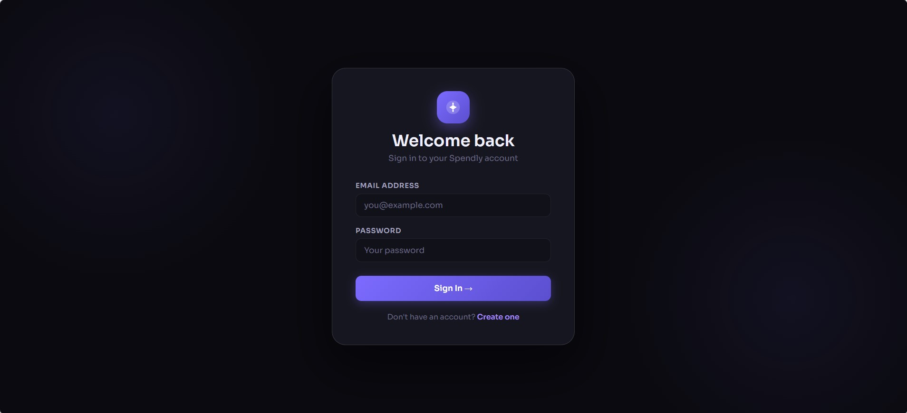
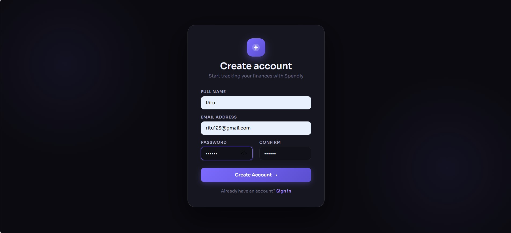
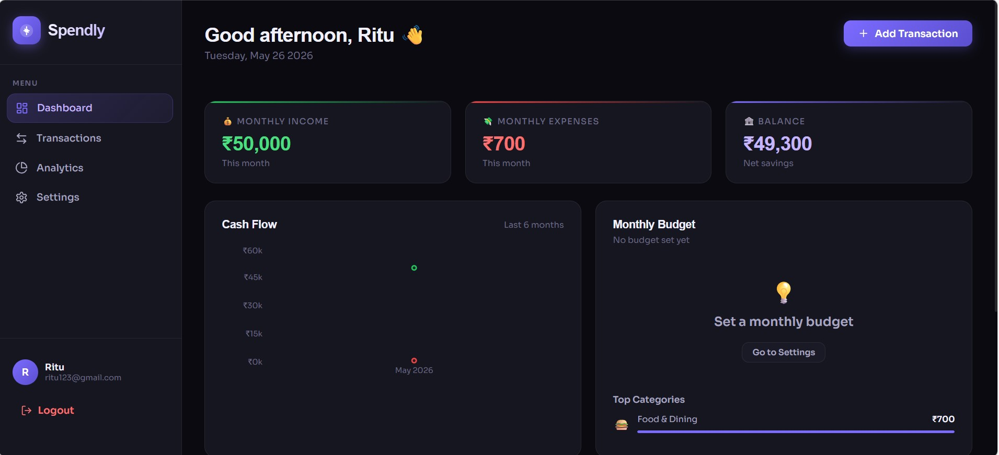
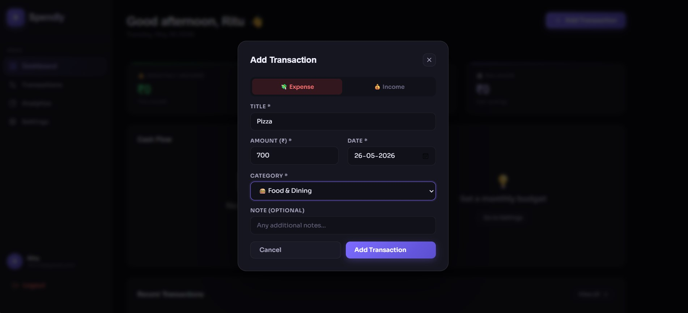
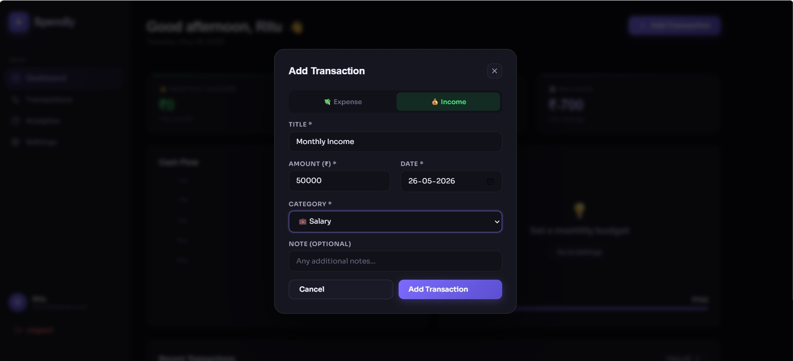
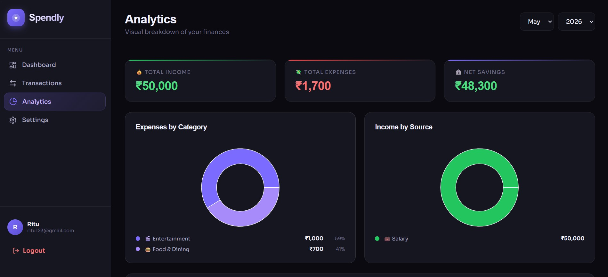
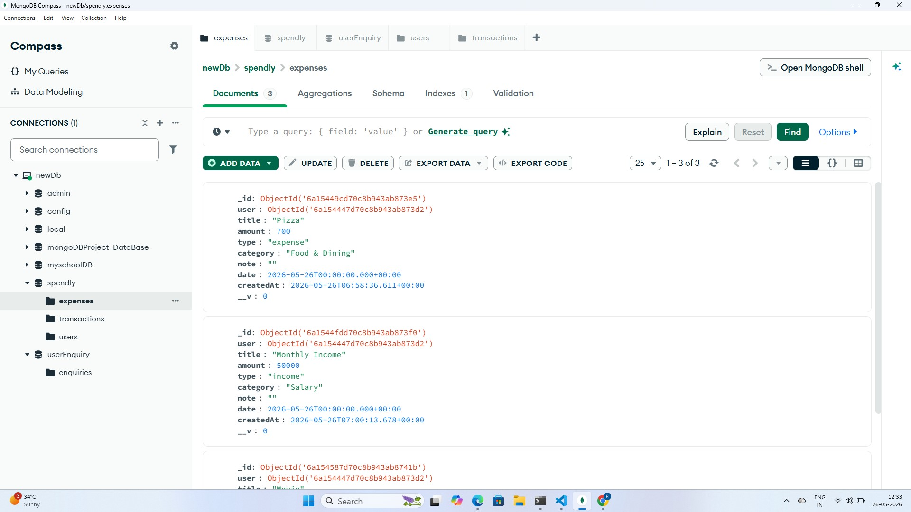
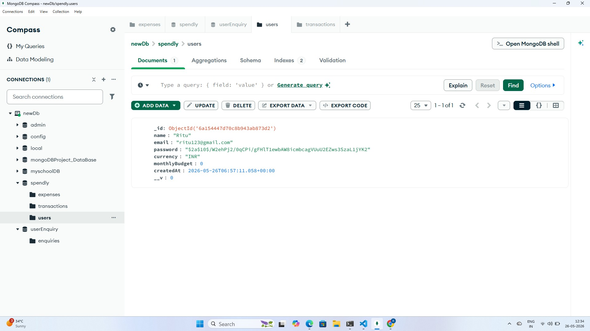

<div align="center">

# 💰 Spendly — Smart Expense Tracker

### Track • Analyze • Save Smarter

[](https://reactjs.org/)
[](https://nodejs.org/)
[](https://mongodb.com/)
[](https://jwt.io/)
[](https://expressjs.com/)
[](https://spendly-lac-two.vercel.app)
[](https://groq.com/)

**A full-stack MERN expense tracking application with AI chatbot, Google OAuth, PDF reports, PWA support, and real-time analytics.**

[🚀 Live Demo](https://spendly-lac-two.vercel.app) • [📸 Screenshots](#-screenshots) • [⚙️ Setup](#-local-setup) • [📡 API Docs](#-api-endpoints)

</div>

---

## 👩‍💻 Developer

**Ritu Mahajan**
> Full Stack Developer | MERN Stack | AI Integration | Passionate about building clean, functional web applications

[](https://github.com/mahajanritu)

---

## ✨ Features

| Feature | Description |
|---------|-------------|
| 🔐 **Secure Authentication** | JWT-based login & register with bcrypt password hashing |
| 🔑 **Google OAuth** | Sign in with Google account instantly |
| 📧 **Forgot Password** | Email reset link via Resend email service |
| 📊 **Interactive Dashboard** | Real-time income, expense & balance overview |
| 📈 **Visual Analytics** | Area charts, Bar charts & Pie charts powered by Recharts |
| 💼 **13 Categories** | Organized expense & income categories with emoji icons |
| 🎯 **Budget Tracking** | Set monthly budget with visual progress & overspend alerts |
| 🔍 **Smart Filters** | Filter by type, category, date with search functionality |
| 🤖 **AI Chatbot** | Groq LLaMA powered — supports 22 Indian languages |
| 🎤 **Speech to Text** | Voice input support for AI chatbot |
| 📄 **PDF Report** | Download monthly expense report as PDF |
| 📱 **PWA Support** | Install app on mobile & desktop like native app |
| 🌙 **Dark Theme UI** | Professional dark mode interface |
| 🗄️ **MongoDB Atlas** | Cloud database with persistent data storage |
| ⚡ **Fast & Lightweight** | Optimized React components with minimal re-renders |

---

## 📸 Screenshots

### 🔐 Login Page


---

### 📝 Register Page


---

### 📊 Dashboard


---

### 💸 Transactions




---

### 📈 Analytics


---

### 🗄️ MongoDB Data — Expenses


---

### 👥 MongoDB Data — Users


---

## 🛠️ Tech Stack

### Frontend
| Technology | Purpose |
|------------|---------|
| React.js 18 | UI Framework |
| React Router v6 | Client-side routing |
| Recharts | Interactive charts |
| Axios | HTTP client |
| React Hot Toast | Notifications |
| Lucide React | Icon library |
| Date-fns | Date formatting |
| jsPDF + AutoTable | PDF report generation |
| CSS Variables | Design system & theming |
| PWA | Install app on device |

### Backend
| Technology | Purpose |
|------------|---------|
| Node.js | Runtime environment |
| Express.js | Web framework |
| Mongoose | MongoDB ODM |
| JWT | Authentication tokens |
| bcryptjs | Password hashing |
| Passport.js | Google OAuth 2.0 |
| Nodemailer + Resend | Email service |
| Groq API (LLaMA) | AI chatbot engine |
| CORS | Cross-origin requests |
| dotenv | Environment variables |
| Nodemon | Development server |

### Database & Services
| Technology | Purpose |
|------------|---------|
| MongoDB Atlas | Cloud database |
| MongoDB Compass | Database GUI |
| Resend | Transactional emails |
| Groq | AI/LLM API |
| Google OAuth | Social login |

---

## 🗂️ Project Structure

```
spendly/
├── 📁 backend/
│   ├── 📁 config/
│   │   └── db.js                  # MongoDB Atlas connection
│   ├── 📁 middleware/
│   │   └── auth.js                # JWT authentication middleware
│   ├── 📁 models/
│   │   ├── User.js                # User schema & password hashing
│   │   └── Expense.js             # Expense/Income schema
│   ├── 📁 routes/
│   │   ├── auth.js                # Auth routes (login/register/forgot)
│   │   ├── expenses.js            # CRUD + Analytics routes
│   │   ├── ai.js                  # AI chatbot + report routes
│   │   └── google-auth.js         # Google OAuth routes
│   ├── 📁 utils/
│   │   └── sendEmail.js           # Resend email service
│   ├── .env                       # Environment variables
│   ├── package.json
│   └── server.js                  # Express entry point
│
├── 📁 frontend/
│   ├── 📁 public/
│   │   ├── index.html
│   │   └── manifest.json          # PWA manifest
│   └── 📁 src/
│       ├── 📁 components/
│       │   ├── Sidebar.js
│       │   ├── TransactionModal.js
│       │   ├── AiChat.js          # AI chatbot component
│       │   └── ProtectedRoute.js
│       ├── 📁 context/
│       │   └── AuthContext.js
│       ├── 📁 pages/
│       │   ├── Dashboard.js
│       │   ├── Transactions.js
│       │   ├── Analytics.js
│       │   ├── Settings.js
│       │   ├── Login.js
│       │   ├── Register.js
│       │   ├── ForgotPassword.js
│       │   ├── ResetPassword.js
│       │   └── GoogleCallback.js
│       ├── 📁 utils/
│       │   ├── api.js
│       │   └── generatePDF.js     # PDF report generator
│       ├── App.js
│       ├── index.js
│       ├── serviceWorkerRegistration.js
│       └── index.css
│
├── 📁 screenshots/
└── README.md
```

---

## ⚙️ Local Setup

### Prerequisites
- Node.js v16+
- MongoDB (local or Atlas)
- npm or yarn

### 1️⃣ Clone the Repository
```bash
git clone https://github.com/mahajanritu/spendly.git
cd spendly
```

### 2️⃣ Backend Setup
```bash
cd backend
npm install
```

Create `.env` file in backend folder:
```env
PORT=4000
MONGODB_URI=mongodb://localhost:27017/spendly
JWT_SECRET=your_secret_key_here
NODE_ENV=development
GOOGLE_CLIENT_ID=your_google_client_id
GOOGLE_CLIENT_SECRET=your_google_client_secret
FRONTEND_URL=http://localhost:3000
GROQ_API_KEY=your_groq_api_key
RESEND_API_KEY=your_resend_api_key
```

```bash
npm run dev
# Server runs on http://localhost:4000
```

### 3️⃣ Frontend Setup
```bash
cd frontend
npm install
npm start
# App runs on http://localhost:3000
```

---

## 📡 API Endpoints

### 🔐 Authentication

| Method | Endpoint | Description | Status |
|--------|-----------|-------------|---------|
| POST | `/api/auth/register` | Register new user | ✅ Completed |
| POST | `/api/auth/login` | Login user | ✅ Completed |
| GET | `/api/auth/me` | Get current user | ✅ Completed |
| PUT | `/api/auth/profile` | Update profile & budget | ✅ Completed |
| POST | `/api/auth/forgot-password` | Send reset email | ✅ Completed |
| POST | `/api/auth/reset-password/:token` | Reset password | ✅ Completed |
| GET | `/api/google/login` | Google OAuth login | ✅ Completed |


### 💸 Expenses & Income
| Method | Endpoint | Description | Auth Required |
|--------|----------|-------------|---------------|
| `GET` | `/api/expenses` | Get all transactions | ✅ |
| `POST` | `/api/expenses` | Add new transaction | ✅ |
| `PUT` | `/api/expenses/:id` | Update transaction | ✅ |
| `DELETE` | `/api/expenses/:id` | Delete transaction | ✅ |
| `GET` | `/api/expenses/stats/summary` | Get analytics & stats | ✅ |

### 🤖 AI
| Method | Endpoint | Description | Auth Required |
|--------|----------|-------------|---------------|
| `POST` | `/api/ai/chat` | AI chatbot (multilingual) | ✅ |
| `GET` | `/api/ai/report` | Generate AI monthly report | ✅ |

---

## 🗄️ Database Schema

### Users Collection
```json
{
  "_id": "ObjectId",
  "name": "Ritu Mahajan",
  "email": "ritu@example.com",
  "password": "hashed_password",
  "currency": "INR",
  "monthlyBudget": 50000,
  "googleId": "google_oauth_id",
  "resetPasswordToken": "hashed_token",
  "resetPasswordExpire": "2024-01-01T00:00:00.000Z",
  "createdAt": "2024-01-01T00:00:00.000Z"
}
```

### Expenses Collection
```json
{
  "_id": "ObjectId",
  "user": "ObjectId (ref: User)",
  "title": "Coffee at Starbucks",
  "amount": 350,
  "type": "expense",
  "category": "Food & Dining",
  "note": "Team meeting",
  "date": "2024-01-15T00:00:00.000Z",
  "createdAt": "2024-01-15T00:00:00.000Z"
}
```

---

## 📊 Categories

| Expenses | Income |
|----------|--------|
| 🍔 Food & Dining | 💼 Salary |
| 🚗 Transportation | 💻 Freelance |
| 🛍️ Shopping | 📈 Investment |
| 🎬 Entertainment | 🎁 Gift |
| ⚡ Bills & Utilities | 📦 Other |
| 💊 Health & Medical | |
| 📚 Education | |
| ✈️ Travel | |
| 📦 Other | |

---

## 🔒 Security Features

- ✅ JWT tokens with 30-day expiry
- ✅ bcrypt password hashing (10 salt rounds)
- ✅ Protected API routes with middleware
- ✅ Google OAuth 2.0 secure login
- ✅ Password reset with expiring tokens
- ✅ User-specific data isolation
- ✅ CORS configuration
- ✅ Environment variables for secrets

---

## 🚀 Deployment

| Service | Platform | Status |
|---------|----------|--------|
| Frontend | Vercel | ✅ [Live](https://spendly-lac-two.vercel.app) |
| Backend | Railway | ✅ [Live](https://spendly-production-1721.up.railway.app) |
| Database | MongoDB Atlas | ✅ Connected |
| Email | Resend | ✅ Active |
| AI | Groq LLaMA | ✅ Active |

---

## 🤖 AI Features

- **Multilingual Support** — 22 Indian languages (Hindi, Marathi, Gujarati, Tamil, Telugu, Kannada, Malayalam, Bengali, Punjabi, and more)
- **Smart Financial Advice** — Budget suggestions, investment tips, savings analysis
- **Speech to Text** — Voice input for hands-free interaction
- **Monthly AI Report** — Detailed financial analysis with recommendations
- **Dynamic Suggestions** — Follow-up questions in user's language

---

<div align="center">

**Made with ❤️ by Ritu Mahajan**

⭐ **Star this repo if you found it helpful!**

</div>
